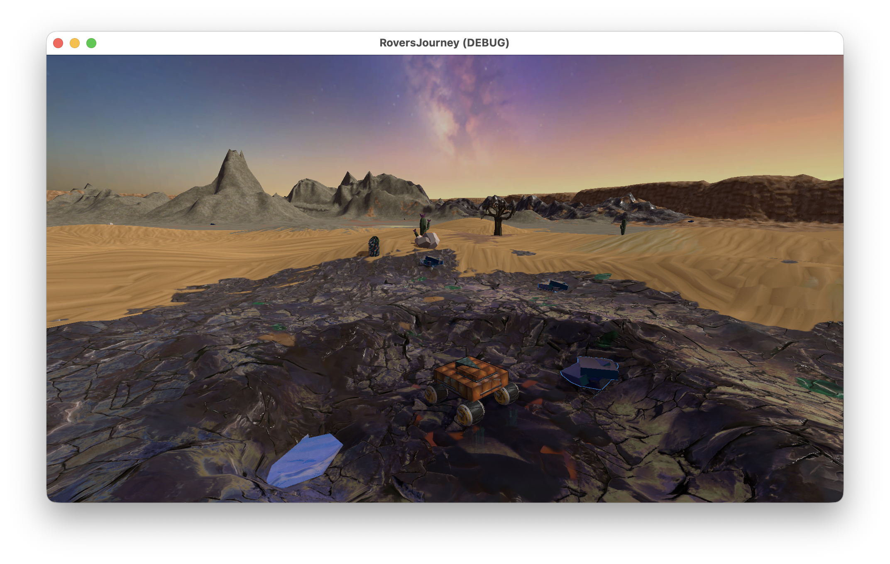

# Rover's Journey

SDENT game prototype 2025 by Dobi & Miro.

**Rover's Journey** is a cozy video game about a rover that crashed on an unknown planet. Explore the new world, get to know it's habitants and find a way to reach back home.

## Setup

Requirements: `git`

- Install [Godot 4.5 .NET](https://godotengine.org/download/)
- Clone this repository: `git clone git@github.com:Emaro/rovers-journey.git`
- Open the project in Godot
- Run

## How to play

- **Goal:** Build all three stages of the communication tower to restore contact with your home planet.
- **Upgrades:** Talk to aliens (press `E`) and bring them the required resources. They will perform the upgrade (repair drivetrain, build tower stage) for you.
- **Drive around** with `W`, `A`, `S`, `D` or the arrow keys.
- **Drift** by pressing `Space`.
- **Full brake** with `X`.
- **Water** and **lava** damage the rover and cost you a life.
- You can also **respawn** using the button in the top right, in case you're stuck or flipped (also costs you a life).
